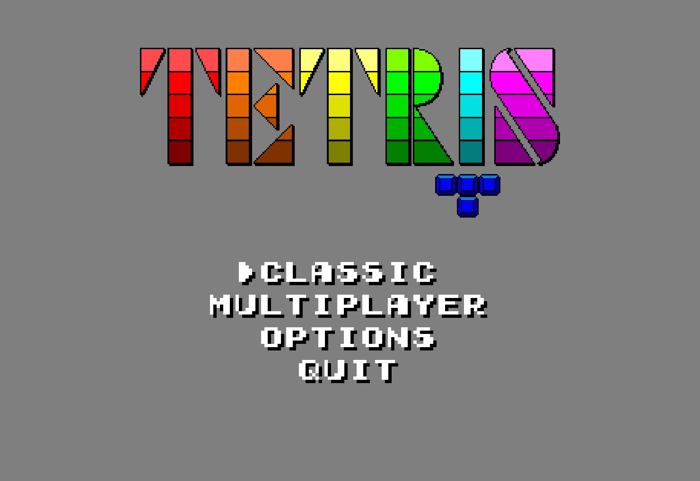
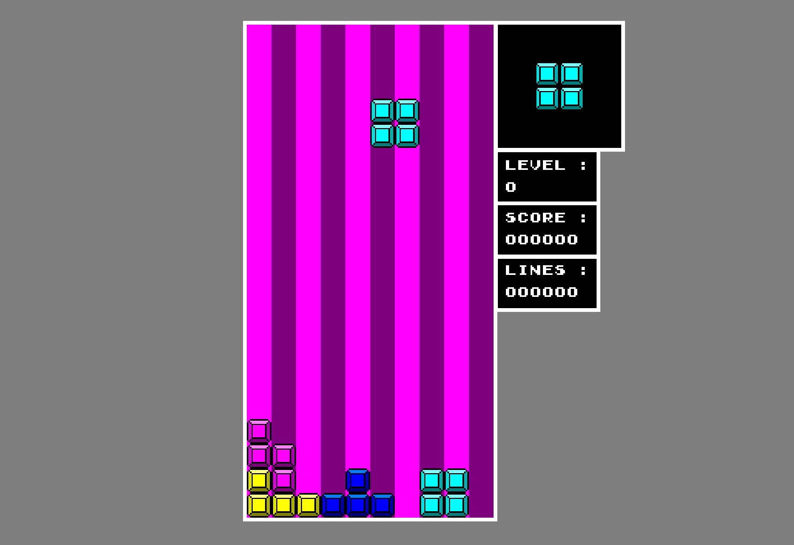
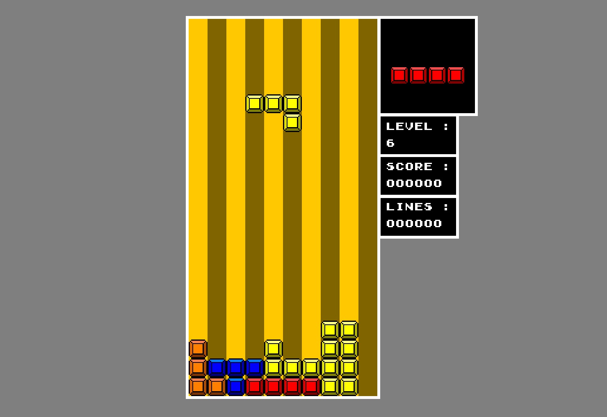
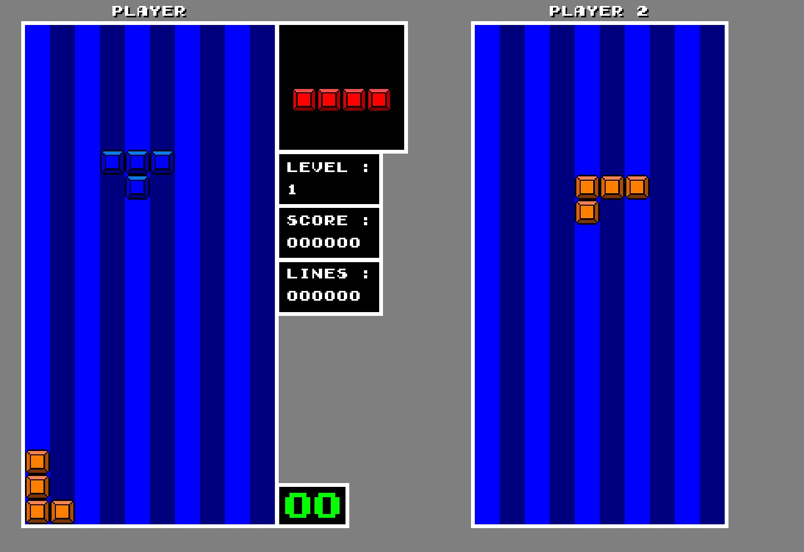

# Tetris-Games

This is a Tetris game in which you can play the classic game or play in LAN multiplayer up to 10 players.
## Features
- 10 levels
- The 3 NES Tetris soundtracks
- Possibility to change controls
- Multiplayer up to 10 players
## Installation
1. Download the repository by clicking on `Code > Download ZIP`
2. Extract the ZIP file
3. Run `main.exe`
## Game Captures

